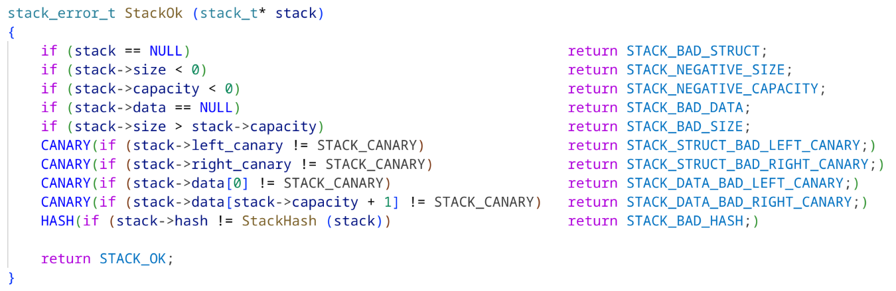
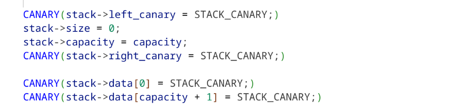
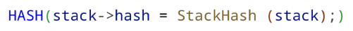
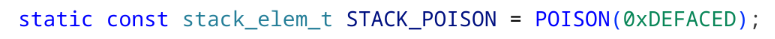
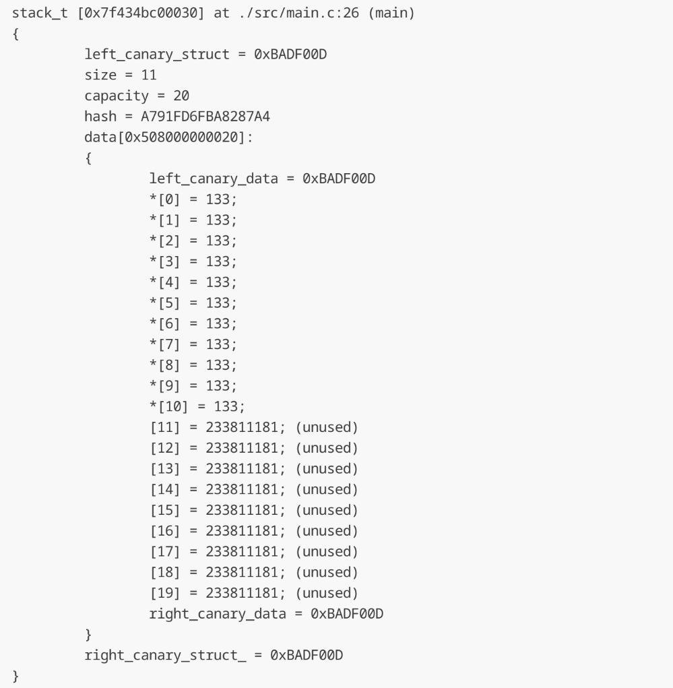

# Stack with canary protection and hash control

## Compilation and launch

**Compilation with protection:**  

`g++ -DCANARY_PROTECTION -DHASH_PROTECTION -DPOISON_PROTECTION -I./include ./src/*.c -o main`  

   **Compilation without protection:**

`g++ -I./include ./src/*.c -o main`  

**Launch:** `./main`  

## Description

Implemented a regular stack on dynamic array, but with some levels of protection.

### Canary protection

Special value (canary) is placed in the beginning and in the end of stack struct and stack buffer.

Each function call and return is checked whether the canary has changed.

This protection helps to avoid accidental or intentional buffer overflow.

### Hash control

Stack struct and buffer are hashed and the hash is updated with each push and pop.

Each function call and return is checked whether the real hash matches the one stored in the struct.

### Poison Values

Unused stack elements are filled with a poison value (0xDEFACED).
It helps to identify whether the stack buffer was changed not via stack functions.

## Dump example

